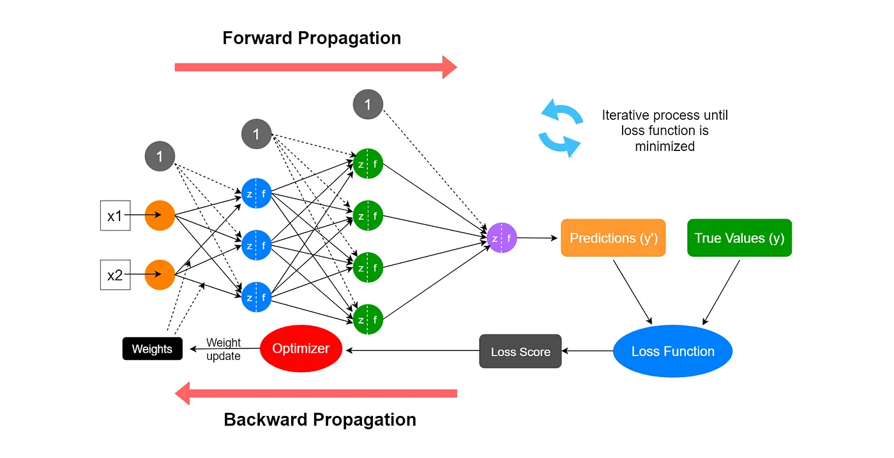

# Neural Networks from Scratch

This repository contains Python scripts and implementations that build a neural network from scratch. The goal is to understand core concepts such as forward propagation, backpropagation, optimization, and loss computation without relying on external libraries.

## Image of Neural Networks 




## About This Repository

This repository offers step-by-step code examples for constructing a neural network, starting from basic concepts and gradually advancing to a complete implementation. It is designed to help both beginners and advanced learners gain a deep understanding of neural networks. 

The journey begins with simple concepts like activation functions and progresses through forward and backpropagation, optimization techniques, and concludes with a fully functional neural network capable of handling multi-class classification.

## Sequence to Explore the Code

To make the best use of this repository, follow the sequence below:

### 1. **Start with the Basics:**
   - `basic1.py`: Introduction to neural network components and basic operations.
   - `basic2.py`: Expanding on basic operations and introducing fundamental neural network mechanics.
   - `basic3.py`: Further examples and exercises to solidify the foundational concepts.

### 2. **Activation and Loss Functions:**
   - `Softmax_Activation.py`: Understand how the softmax activation function works for multi-class classification.
   - `Categorical_Cross_Entropy_Loss.py`: Learn how the categorical cross-entropy loss is computed for classification problems.

### 3. **Forward Propagation:**
   - `Forward_Propagation.py`: See how input data flows through the network, including the calculations of weighted sums, biases, and activation functions.

### 4. **Optimization Techniques:**
   - `Adam_Optimizer.py`: Explore the Adam optimization algorithm to update weights during training efficiently.

### 5. **Bringing It All Together:**
   - `Neural_Network_final.py`: The culmination of the entire process, this script contains a complete implementation of a neural network capable of handling multi-class classification tasks.

### 6. **Practical Example:**
   - `train_iris.py`: A practical example using the Iris dataset to train the neural network and demonstrate its functionality.

## Key Neural Network Concepts

### 1. **Structure of a Neural Network**
- **Input Layer:** Accepts raw data and passes it to the network.
- **Hidden Layers:** Intermediate layers where computations occur. Each layer consists of neurons interconnected by weights.
- **Output Layer:** Produces the final predictions or classifications.

### 2. **Forward Propagation**

In forward propagation, data flows through the network from the input layer to the output layer:

1. Calculate **z**:
```
z = inputs * weights + bias
```

2. Apply the **activation function**:
   - Use **ReLU** or its variants in the hidden layers.
   - Use **Softmax** for multi-class classification in the output layer.
   - Use **Sigmoid** for binary classification problems.

3. Identify the problem type:
   - **Regression**: Use loss functions like MSE, MAE, RMSE, or Huber loss.
   - **Binary Classification**: Use binary cross-entropy loss.
   - **Multi-class Classification**: Use categorical cross-entropy loss.

### 3. **Backpropagation**

Backpropagation updates the weights in the network by minimizing the error (loss):

1. Compute the gradient of the loss function with respect to the weights and biases.
2. Update the weights using an optimizer like **Adam**

## Additional Important Topic: Dropout Regularization (**Not Used Right Now Here**)

**Dropout** is a regularization technique used to prevent overfitting in neural networks. It works by randomly setting a fraction of input units to zero during training, forcing the network to learn more robust features and dependencies. 

For example, during training, if a dropout rate of 0.2 is used, 20% of the neurons will be ignored in each training iteration

## Special Thanks

A special thanks to the following resources and individuals for their invaluable contributions to the understanding of neural networks:

- **Krish Naik** for his insightful tutorials.
- **Harrison Kinsley (Sentdex)** for practical coding examples.
- Resources from [AIML.com](https://www.aiml.com), [Medium](https://medium.com), [GeeksforGeeks](https://www.geeksforgeeks.org), and many more.

